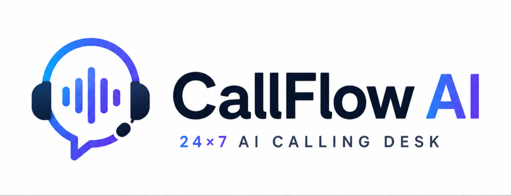

<div align="center">



**A 24×7 AI calling desk built on [CALL-E](https://heycall-e.com).**

Feed in contacts and a goal. CallFlow AI dials, holds real conversations,
extracts typed results, and escalates only what needs a person.

[](https://www.python.org)
[](https://fastapi.tiangolo.com)
[](https://nextjs.org)
[](https://heycall-e.com)
[](#tests)

Built for the [CALL-E: Your Code Is Calling](https://call-e.devpost.com) hackathon.

</div>

---

## The problem

Outbound calling costs enormous manual effort and buys you no visibility.

In a normal call log, a delighted customer and a furious one look identical —
both just say `completed`. Teams burn hours dialing, repeating the same five
questions, and typing notes into a CRM afterwards. You find out a call went
badly when someone escalates, which is far too late.

**CallFlow AI turns every conversation into typed data the moment it ends**, so
the work that needs a human is visible immediately and the rest closes itself.

---

## What it does

| | |
|---|---|
| **Campaigns, not scripts** | Write a goal in plain English. CALL-E improvises the conversation and adapts when people go off-script. |
| **Typed results** | Every call returns schema-validated JSON via CALL-E's native `result_schema`. No transcript scraping. |
| **Sentiment triage** | Frustration and opt-outs escalate to a person. Bad timing is queued for a polite retry. Clean calls auto-close. |
| **Build your own** | Create unlimited campaigns from the dashboard with custom extraction fields. |
| **Safe by default** | Dry run is on until you turn it off. An allowlist and per-run ceiling stop accidental calls. |

---

## Architecture

```
┌─────────────────┐         ┌──────────────┐         ┌──────────────┐
│  Next.js 16     │  HTTP   │   FastAPI    │  SDK    │    CALL-E    │
│  dashboard      ├────────►│  orchestrator├────────►│  voice agent │
└─────────────────┘         └──────┬───────┘         └──────────────┘
                                   │                   dials · speaks
                            ┌──────▼───────┐           adapts · listens
                            │ safety gate  │
                            │ E.164        │
                            │ allowlist    │
                            │ call ceiling │
                            └──────┬───────┘
                                   │
                            ┌──────▼───────┐
                            │ result_schema│  typed JSON back
                            └──────┬───────┘
                                   │
                            ┌──────▼───────┐
                            │    triage    │
                            └──────┬───────┘
                    ┌──────────────┼──────────────┐
                    ▼              ▼              ▼
              auto-close      retry later    needs human
```

**CALL-E is the calling agent.** It owns the phone number, dialer, speech
recognition, conversational model, turn-taking, voicemail detection, and IVR
handling. CallFlow AI is the operations layer around it.

---

## Quick start

**Backend** — Python 3.11+

```bash
python -m venv .venv
.venv/Scripts/activate           # Windows  ·  source .venv/bin/activate on Unix
pip install -e .

cp .env.example .env             # add your CALLE_API_KEY
python run_api.py                # → http://127.0.0.1:8000
```

**Frontend** — Node 20+

```bash
cd web
npm install
npm run dev                      # → http://localhost:3000
```

Get an API key at [dashboard.heycall-e.com](https://dashboard.heycall-e.com).
New accounts include free calls.

---

## Safety

> **CallFlow AI places real phone calls.** Every guard below fails closed.

| Guard | Behaviour |
|---|---|
| `CALLFLOW_DRY_RUN` | **Defaults to `true`.** Renders and validates everything; dials nothing. |
| `CALLFLOW_ALLOWLIST` | When non-empty, only these E.164 numbers can be dialed. |
| `CALLFLOW_MAX_CALLS_PER_RUN` | Hard ceiling per process run. Protects your credit balance. |
| E.164 validation | Malformed numbers are rejected before reaching CALL-E. |

Phone numbers are masked (`+15******100`) in every log, API response, and UI
surface. All sample data uses reserved fictional numbers (`+1 555 0100–0199`)
that cannot connect to a real person.

**While developing, keep `CALLFLOW_DRY_RUN=true` and set an allowlist to your
own number.**

### Dry run

Dry run exercises the entire pipeline — goal templating, contact validation, the
safety gate, and the result shape — without placing a call or spending a credit.

```bash
curl -X POST http://127.0.0.1:8000/api/runs \
  -H 'Content-Type: application/json' \
  -d '{"campaign_id":"travel-discovery","dry_run":true,
       "contacts":[{"name":"Aditi","phone":"+15555550100",
                    "context":{"enquiry_note":"Bali in December"}}]}'
```

---

## How a campaign works

A campaign is a **goal template** plus a **result schema**:

```python
Campaign(
    id="travel-discovery",
    name="Travel enquiry follow-up",
    goal_template=(
        "You are CallFlow AI, a friendly travel consultant calling {name} "
        "back about their holiday enquiry.\n\n"
        "Open by greeting them by name and confirming this is a good time. "
        "If it is not, apologise, ask when to call back, and end politely.\n\n"
        "Known context: {enquiry_note}\n\n"
        "If they sound annoyed, do not push. Offer a human colleague instead."
    ),
    region="IN",
    language="en",
)
```

CALL-E returns this, validated against the schema:

```json
{
  "outcome": "interested",
  "sentiment": "positive",
  "frustration_signals": false,
  "destination": "Dubai",
  "travel_date": "2026-12-18",
  "party_size": 4,
  "summary": "Wants a 4-person Dubai package in mid-December."
}
```

Triage reads those typed fields — never prose — to decide the disposition.

### Triage rules

| Signal | Disposition |
|---|---|
| Asked never to be called again | **Needs human** — suppress and log |
| Explicitly asked for a person | **Needs human** |
| Frustration detected | **Needs human** |
| Negative tone, no frustration | **Retry later** — a bad time isn't a bad mood |
| Busy / no answer / voicemail | **Retry later** |
| Completed, no escalation signals | **Auto-closed** |

---

## API

| Endpoint | Purpose |
|---|---|
| `GET /api/health` | Backend status and active safety settings |
| `GET /api/campaigns` | List campaigns |
| `POST /api/campaigns` | Create a campaign with custom extraction fields |
| `DELETE /api/campaigns/{id}` | Remove a user-created campaign |
| `POST /api/preview` | Render goals without touching CALL-E |
| `POST /api/runs` | Start a run (background) |
| `GET /api/runs/{id}` | Poll status, outcomes, and stats |

---

## Project layout

```
callflow/               Python backend
├── api.py              FastAPI surface
├── calle_client.py     CALL-E SDK wrapper
├── orchestrator.py     gate → dial → poll → triage
├── safety.py           E.164, masking, dial gate
├── campaigns.py        built-in + user campaigns
├── schemas.py          result_schema definitions
├── triage.py           disposition logic
├── models.py           domain models
└── store.py            in-memory run store

web/                    Next.js 16 dashboard
├── app/                landing page + dashboard
└── lib/                API client, CSV parsing

tests/                  56 tests
```

---

## Tests

```bash
pytest -q     # 56 passed
```

Coverage focuses on what can cause harm: the safety gate fails closed, masking
never leaks more than half a number, dry run provably never touches the
gateway, and triage precedence is correct.

---

## Notes from the build

**`language` is not a valid CALL-E recipient field** — it's `locale`. The API
rejects the former with a `422 extra_forbidden`, which is only discoverable from
the error payload.

**CALL-E validates task substance.** A thin goal like `"Call and ask about their
trip"` is rejected with `call_not_ready`. The goal must state what to say, ask,
and do on success or failure — the dashboard enforces a 40-character minimum.

**The goal field is the entire product.** A one-line task produced a confusing
robocall; the same platform with a well-written goal produced a consultant. That
difference is what CallFlow AI's campaign templates exist to manage.

---

## Status

**Working** — campaigns (built-in and user-created), safety gate, CALL-E
integration, typed extraction, sentiment triage, CSV import, dashboard with
live polling, dry-run mode.

---

## Future enhancements

### WhatsApp delivery

Right now the call ends with the agent saying a consultant will follow up. The
natural next step is to **send the contact everything that was agreed, in
writing, on WhatsApp** — so they have a record and the team has a receipt.

The structured result already contains everything the message needs:

```json
{
  "destination": "Dubai",
  "travel_date": "2026-12-18",
  "party_size": 4,
  "service_interest": "package",
  "ready_for_quote": true
}
```

A post-call step would render that into a template message and send it through
the WhatsApp Cloud API, keyed off the contact who just spoke.

Two constraints shape the design:

- **Consent must come from the call.** The agent has to ask, and the answer has
  to land in the schema as a typed field, before anything is sent. A silent
  message to someone who didn't agree is worse than no message.
- **Business-initiated messages need pre-approved templates.** WhatsApp only
  allows free-form replies inside a 24-hour window the user opened. Outside it,
  messages must use an approved template and are billed per conversation — so
  this is a paid, approval-gated integration, not a free bolt-on.

The config hooks (`WHATSAPP_TOKEN`, `WHATSAPP_PHONE_NUMBER_ID`) already exist
and read as empty strings when unset.

### Beyond WhatsApp

| | |
|---|---|
| **Booking tools** | Let a campaign call MCP tools — flights, hotels, tours — driven by the extracted outcome, so a confirmed intent books itself. |
| **Scheduled campaigns** | Recurring runs with time-zone-aware calling windows, so nobody is dialed at 3am local time. |
| **Persistent storage** | Runs are in-memory today. Postgres would give history, per-campaign analytics, and sentiment trends over time. |
| **Inbound calls** | Handle calls coming *in*, not just going out. |
| **CRM write-back** | Push outcomes to HubSpot or Salesforce so results land where the team already works. |
| **Retry orchestration** | Act on the `retry` disposition automatically instead of only surfacing it. |

---

<div align="center">

Built by [mohdcodes](https://mohdcodess.onrender.com) ·
[GitHub](https://github.com/mohdcodes) ·
[LinkedIn](https://linkedin.com/in/mohdcodes)

Powered by [CALL-E](https://heycall-e.com)

</div>
