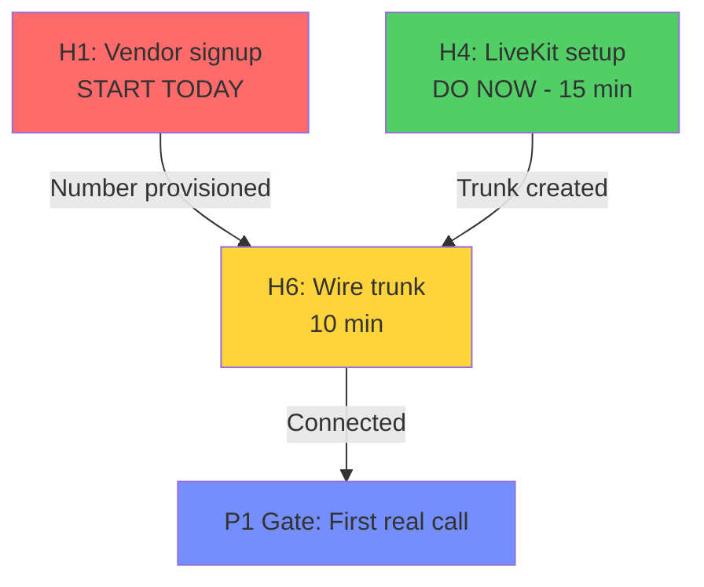

# P0 Documentation - Clear the Ground

**Phase:** P0 (Clear the ground)  
**Gate Captain:** Mridul  
**Cost:** ~3 person-weeks  
**Status:** Infrastructure complete, execution in progress

---

## Quick Links

| Document | Purpose | When to Use |
|----------|---------|-------------|
| [P0_HET_STATUS.md](P0_HET_STATUS.md) | Het's status tracker and action plan | Daily status, what's blocked, what's next |
| [H1_VENDOR_CHECKLIST.md](H1_VENDOR_CHECKLIST.md) | Twilio/Plivo signup and number provisioning | START TODAY - critical path |
| [H3_VM2_VERIFICATION.md](H3_VM2_VERIFICATION.md) | VM2 deployment verification | After VM2 is provisioned |
| [H4_LIVEKIT_CHECKLIST.md](H4_LIVEKIT_CHECKLIST.md) | LiveKit Cloud setup | Ready NOW (no blockers) |
| [TELEPHONY_COMPLIANCE.md](TELEPHONY_COMPLIANCE.md) | DLT/TRAI requirements | Reference for H2 |

---

## P0 Gate Definition

From plan-of-record section 8:

> "A number that can dial an Indian mobile · VM2 reachable and deployable · chat page
> and false marketing claims gone · docs/GRADING.md written and agreed by all six."

**Done-when:**
- [x] Chat page removed (J1 - Jatin's work)
- [ ] Number that can dial (H1 - Het, blocked on vendor)
- [ ] VM2 reachable (H3 - Het, infra done, needs VM2)
- [ ] docs/GRADING.md exists (A1 - Arbaaz, needs M1/S1 research)

---

## Het's Tasks (H1-H6, H7-H14 in later phases)

### P0 Tasks

| ID | Task | Status | Time | Blocker | Action |
|----|------|--------|------|---------|--------|
| **H1** | One number that can dial | 🟡 Tooling done | 2-5 days | Vendor KYC | **START TODAY** |
| **H2** | DLT/TRAI registration | 🟡 Docs done | Weeks | M10 entity | Submit when M10 done |
| **H3** | VM2 provisioned | 🟡 Infra done | 30 min | Need VM2 | Test deploy |
| **H4** | LiveKit Cloud + trunk | 🟢 Ready | 15-20 min | **NONE** | **DO NOW** |
| **H5** | Move Next build off VM | ✅ Complete | - | - | - |
| **H6** | Wire the trunk | 🔴 BLOCKED | 10 min | H1 + H4 | Wait |

---

## What Got Built (5 commits)

### Infrastructure Code (3 commits)

**1. Telephony tooling and compliance** (`e892103`)
```
scripts/probe-dial.py           # Test Twilio/Plivo from laptop
scripts/probe-dial-answer.xml   # Plivo answer file
docs/TELEPHONY_COMPLIANCE.md    # DLT/TRAI full guide
ISSUES.md                       # Issue #209 created
```

**2. VM2 deployment infrastructure** (`5fa3a46`)
```
.github/workflows/ci-cd.yml     # provision-voice → deploy-voice chain
scripts/bootstrap-voice.sh      # Python 3.12 provisioning via uv
DEPLOYMENT.md                   # §3b VM2 documentation
ecosystem.config.js             # callflow-voice pm2 entry
```

**3. LiveKit setup documentation** (`1e0803a`)
```
DEPLOYMENT.md §2b               # Complete setup guide
```

### Documentation (2 commits)

**4. Status tracker** (`b09e029`)
```
docs/P0_HET_STATUS.md           # Comprehensive tracking doc
```

**5. Execution checklists** (`78ecd40`)
```
docs/H1_VENDOR_CHECKLIST.md     # Twilio/Plivo step-by-step
docs/H3_VM2_VERIFICATION.md     # Deploy verification
docs/H4_LIVEKIT_CHECKLIST.md    # LiveKit setup steps
```

---

## Critical Path



**The bottleneck is H1.** Every day H1 doesn't start is a day added to the P1 gate.

---

## Immediate Actions (Today - 13 Sep 2026)

### 1. START H1 🔥
```bash
# Pick Twilio (recommended) or Plivo
# Follow: docs/H1_VENDOR_CHECKLIST.md

# Steps:
1. Create account (5 min)
2. Upgrade to paid (2 min)
3. Submit KYC (10 min, then wait 2-5 days)
4. When approved: provision number
5. Test: python scripts/probe-dial.py --to +91...
```

### 2. EXECUTE H4 🟢
```bash
# No blockers - do this NOW
# Follow: docs/H4_LIVEKIT_CHECKLIST.md

# Steps (15-20 min total):
1. Create LiveKit Cloud project (5 min)
2. Create SIP trunk (5 min)
3. Update .env on both VMs (5 min)
4. Record in DEPLOYMENT.md (2 min)
5. Update ISSUES.md #209 (1 min)
```

### 3. VERIFY H3 🟡
```bash
# Follow: docs/H3_VM2_VERIFICATION.md

# Prerequisites:
- VM2 must exist
- Set VOICE_VM_HOST, VOICE_APP_DIR, VOICE_ENV_FILE_B64 in GitHub

# Test (30 min):
1. Touch apps/voice-runtime/app/worker.py
2. git push origin dev
3. Watch CI deploy-voice succeed
4. ssh to VM2, run: pm2 list
5. Verify callflow-voice[-dev] is online
```

---

## Timeline

| Milestone | Target | Notes |
|-----------|--------|-------|
| H1 started | 13 Sep | TODAY - vendor signup |
| H4 complete | 13 Sep | Same day - 15 minutes |
| H3 verified | 15 Sep | After VM2 is provisioned |
| H1 KYC approved | 18 Sep | Vendor queue (2-5 days) |
| H1 number provisioned | 18 Sep | Same day as KYC approval |
| H6 wired | 18 Sep | Same day, 10 minutes |
| P0 gate verified | 20 Sep | probe-dial success |

**P0 completes in ~1 week if H1 starts today.**

---

## Tools and Scripts

### probe-dial.py
```bash
# Test a Twilio or Plivo number directly
export TWILIO_ACCOUNT_SID=AC...
export TWILIO_AUTH_TOKEN=...
export TWILIO_NUMBER=+91...

python scripts/probe-dial.py --to +919876543210

# Expected: "Twilio accepted. Call SID AC... Rang +91...10 from +91...XX."
# The handset rings within seconds. That's the proof.
```

### H3 health check
```bash
# One command to verify VM2 status
ssh <VM_USER>@<VOICE_VM_HOST> '
  pm2 list | grep callflow-voice &&
  pm2 logs callflow-voice-dev --lines 5 --nostream &&
  grep "^[A-Z_]*=" /var/www/callflow-ai-voice-dev/.env | cut -d= -f1
'
```

---

## Architecture Notes

### Two VMs, One Deployment

**VM1 (API + Web):**
- nginx, TLS termination
- Next.js (next start on prebuilt artifact)
- FastAPI under pm2
- Redis (after H9)
- Postgres → Supabase (off-box)

**VM2 (Voice Runtime):**
- `apps/voice-runtime` workers only
- No nginx, no ports, no database
- Dials out to LiveKit Cloud
- Reports back to VM1 via HTTP

**Why separate:**
1. Capacity: media workers must not restart with the web app
2. Security: VM2 holds no database credentials or provider keys
3. Isolation: voice failures don't take down the API

**Communication:**
- VM2 → API: HTTP POST to `/internal/v1/runs/{id}/complete`
- API → VM2: LiveKit dispatch (out-of-band)

---

## Environment Variables

### Both VMs must match (byte-for-byte)
```bash
LIVEKIT_URL=wss://<project>.livekit.cloud
LIVEKIT_API_KEY=...
LIVEKIT_API_SECRET=...
LIVEKIT_AGENT_NAME=callflow-voice
```

### API VM only
```bash
LIVEKIT_SIP_HOST=<project>.sip.livekit.cloud
```

### Voice VM only
```bash
CALLFLOW_PUBLIC_API_URL=https://[dev.]calllflow.com
CALLFLOW_INTERNAL_API_SECRET=...  # must match API VM
```

---

## Verification Commands

### H1 - Number works
```bash
python scripts/probe-dial.py --to <teammate-mobile>
# Handset rings → H1 COMPLETE
```

### H3 - VM2 deploys
```bash
ssh <VM_USER>@<VOICE_VM_HOST>
pm2 list
# Shows: callflow-voice[-dev] | online → H3 COMPLETE
```

### H4 - LiveKit configured
```bash
curl -I wss://<project>.livekit.cloud
# Returns WebSocket handshake → H4 COMPLETE
```

### H6 - End-to-end (after H1+H4)
```bash
# Start a run from dashboard
# Dial should ring a real handset
# Agent should speak
# Transcript should POST back to API
```

---

## Cost Summary (P0 only)

| Item | Cost | Frequency |
|------|------|-----------|
| Twilio/Plivo number | $0.80-1.50 | Monthly |
| Test calls | ~$0.05/min | One-time |
| LiveKit Cloud | Free tier OK | Monthly |
| VM1 (existing) | $0 | - |
| VM2 (provision) | TBD | Monthly |
| **P0 total** | **~$5 first month** | Testing only |

Production costs tracked separately in P4 (H13, H14).

---

## Success Criteria

**P0 gate passes when:**

1. ✅ Chat page removed (done)
2. ✅ False marketing claims removed (done)
3. ⏳ A number that can dial an Indian mobile (H1 → H6)
4. ⏳ VM2 reachable and deployable (H3)
5. ⏳ docs/GRADING.md written and agreed (A1 - Arbaaz's work)

**Het's portion:** items 3 and 4, both deliverable by ~18 Sep if H1 starts today.

---

## Next Phase (P1)

After P0 gate passes, Het's P1 tasks:

- **H7** - Ship the additive migration (new columns from section 5)
- **H8** - Log shipping off VM2
- **H9** - Redis and real rate limiter (ISSUES.md #5)

P1 gate requires "A call placed from the dashboard reaches a real handset and lands a
row in Postgres, on video" (track A) plus grading rules working (track B).

---

## Questions?

- **H1 blocked?** → Update ISSUES.md #209 same day
- **H3 VM2 doesn't exist?** → Provision it first (see H3 checklist prerequisites)
- **H4 LiveKit fails?** → Check troubleshooting in H4 checklist
- **General status?** → docs/P0_HET_STATUS.md

---

## Related Documentation

- [DEPLOYMENT.md](../DEPLOYMENT.md) - Full deployment guide
- [TELEPHONY_COMPLIANCE.md](TELEPHONY_COMPLIANCE.md) - DLT/TRAI requirements
- [SYSTEM.md](../SYSTEM.md) - As-built reference
- [ISSUES.md](../ISSUES.md) - Issue tracker (#209 is H1/H2 tracking)
- Plan of record (shared separately) - 70 tasks across 6 people

---

**Bottom line:** H1 vendor signup is the critical path. Start it today. H4 takes 15
minutes - execute it now. Then P0 is just waiting on vendor approval and VM2 provisioning.
